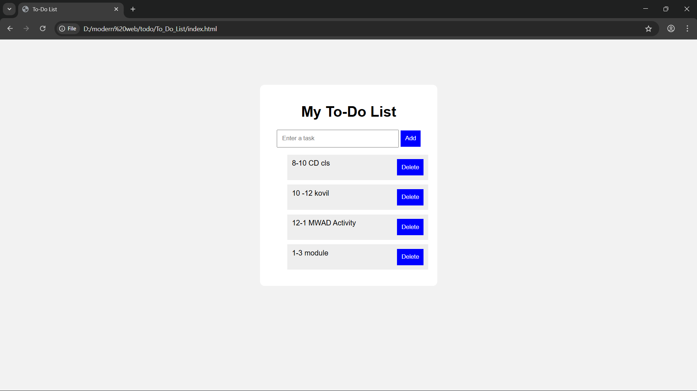

# Ex03 To-Do List using JavaScript
## Date:10/03/2026

## AIM
To create a To-do Application with all features using JavaScript.

## ALGORITHM
### STEP 1
Build the HTML structure (index.html).

### STEP 2
Style the App (style.css).

### STEP 3
Plan the features the To-Do App should have.

### STEP 4
Create a To-do application using Javascript.

### STEP 5
Add functionalities.

### STEP 6
Test the App.

### STEP 7
Open the HTML file in a browser to check layout and functionality.

### STEP 8
Fix styling issues and refine content placement.

### STEP 9
Deploy the website.

### STEP 10
Upload to GitHub Pages for free hosting.

## PROGRAM
index.html
~~~
<!DOCTYPE html>
<html>
<head>
    <title>To-Do List</title>
    <link rel="stylesheet" href="style.css">
</head>

<body>

    <h1>My To-Do List</h1>

    <input type="text" id="taskInput" placeholder="Enter a task">

    <button onclick="addTask()">Add</button>

    <ul id="taskList"></ul>

</body>
</html>
~~~
style.css
~~~
body{
    font-family: Arial;
    background: #f2f2f2;
}

.container{
    width: 350px;
    margin: 100px auto;
    background: white;
    padding: 20px;
    text-align: center;
    border-radius: 10px;
}

input{
    padding: 10px;
    width: 70%;
}

button{
    padding: 10px;
    background: blue;
    color: white;
    border: none;
}

li{
    list-style: none;
    padding: 10px;
    margin-top: 10px;
    background: #eee;
    display: flex;
    justify-content: space-between;
}
~~~
script.js
~~~
function addTask(){

    let input = document.getElementById("taskInput");

    let task = input.value;

    if(task === ""){
        alert("Please enter a task");
        return;
    }

    let li = document.createElement("li");

    li.innerHTML = task;

    let deleteBtn = document.createElement("button");

    deleteBtn.innerHTML = "Delete";

    deleteBtn.onclick = function(){
        li.remove();
    };

    li.appendChild(deleteBtn);

    document.getElementById("taskList").appendChild(li);

    input.value = "";
}
~~~

## OUTPUT

## RESULT
The program for creating To-do list using JavaScript is executed successfully.
